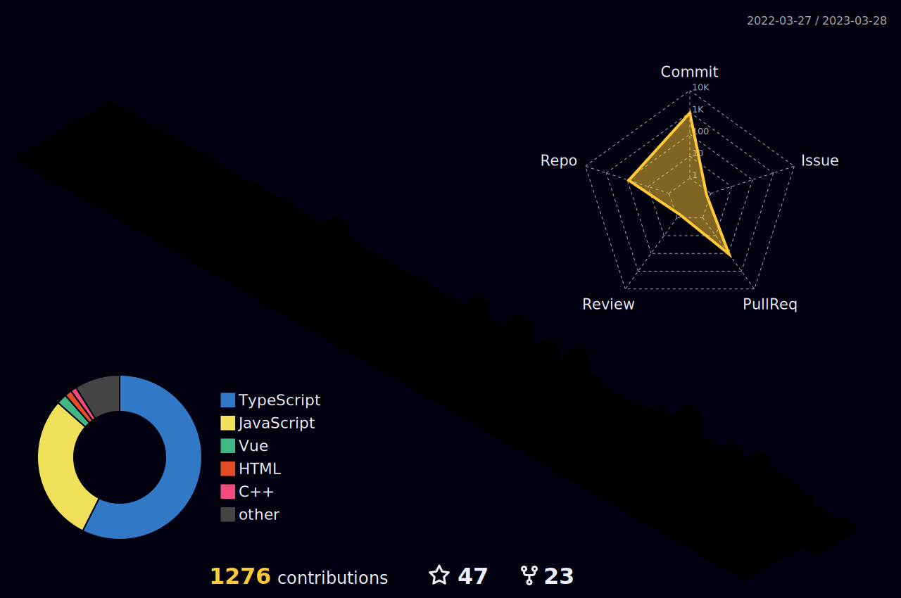

Hey, pessoas, espero que estejam bem! ✨

Podem me chamar de Lua, tenho 22 anos e sou de Maceió, AL. Fiz um blog de livros aos 14 anos, foi quando tive minha primeira experiência com a linguagem de marcação e desde então me apaixonei pela tecnologia e pela possibilidade das minhas criações terem contato direto com outras pessoas. Meu objetivo como programadora é me especializar cada vez mais no Front-end, buscando por conhecimentos e novos recursos que possam proporcionar a melhor experiência para o usuário.

Tecnologias: 
 
 
 
 
 
 

Aqui abaixo estarei deixando alguns links onde vocês poderão me encontrar. Ah, sintam-se à vontade para conhecer meus projetos, estou aberta à sugestões e feedbacks! ^^ 
 
  

  
 ##
 

 
 

 

 

 

 

  

 |  |  |  
 | ----------- | ----------- |

  <a href="https://github.com/lhuanalee">
  
  

 

